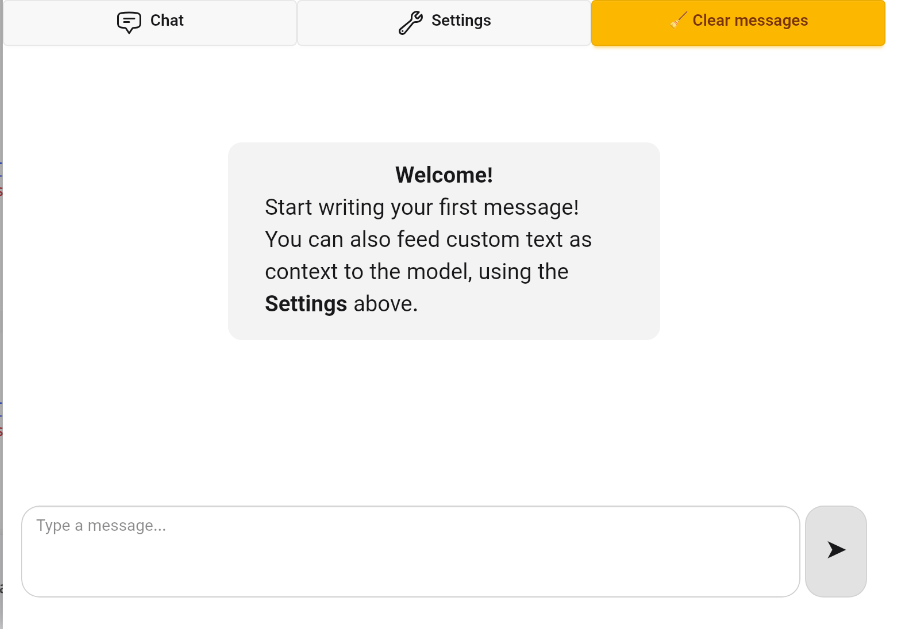
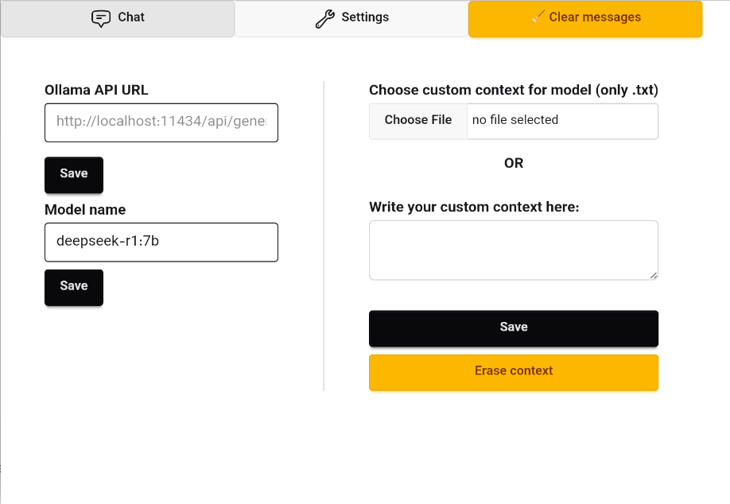

# CheTauri
In Persian, "che tori" means "how are you". This project is about a chatbot interface written using Tauri so I named it **CheTauri**.  

## Features
* Chat with **custom context** support
* **Rust** backend, **React / Vite / Typescript** frontend
* **Cross platform** app (Linux, Windows, Android, ...) with Tauri

## Screenshots

  
  

# Requirements
* You need to install 'webkit2gtk' on Linux, or 'Microsoft Edge Webview2 Runtime' on Windows
* Official Docker installation with NVIDIA Cuda Runtime Container Toolkit enabled

# Usage
* Clone this repository
* Inside project directory, run `docker compose up` to start the Ollama API for local LLM.
* Install required npm modules into the project directory with `npm install`
* Build the app with `npm run tauri build`
* Run the built executable found inside `src-tauri/target` sub-folders.